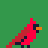
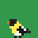
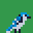
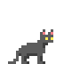
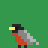
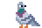

# Other Projects

A catalog of completed and in-progress projects that don't have public repositories.

 &nbsp;  &nbsp; 

---

## Parasite — 2D Platformer (Unity)

A solo-developed 2D action-platformer built in **Unity** with **C#**. The player moves through an interactive, nature-themed world that blends exploration, questing, and story.

**Design pillars**

- **Platforming + combat** — responsive 2D movement paired with real-time minigames and combat system.
- **Questing** — objectives and progression that give the world structure and direction.
- **Interactive world** — environments and characters the player can engage with and affect.
- **Authored content** — levels, environments, and characters designed as a cohesive natural world.

Built end to end by one developer: game design, programming, and content. **Currently in active development.**

 &nbsp; 

In-game pixel art — hand-drawn in Aseprite.

---

## Sérain — Product Website

A brand and product site for **Sérain**, a line of botanical tisanes — each "expression" themed around a place in the world. Live at **[serain.us](https://serain.us)**, deployed on **Netlify** with **Cloudflare** DNS on a custom domain.

**Highlights**

- **Interactive 3D bottle** — a single `glTF` (`bottle.glb`) model rendered with **Three.js / WebGL**. One offscreen renderer is reused across slides and blitted to per-slide 2D canvases for performance; the bottle's liquid material is recolored per expression to match each blend.
- **Editorial scroll experience** — opens on an Old-French dictionary entry for *sérain* ("rain falling from a cloudless sky"), then scroll-snaps into a horizontal carousel of seven product expressions, each with tasting notes, ingredients, and prose.
- **Polished input handling** — supports trackpad, mouse, and touch swipe, with clone-based seamless looping and trailing-delta wheel smoothing to detect the leading edge of a gesture.
- **Email capture + feedback** — "notify me" sign-ups for in-development blends and per-product feedback, wired to **Netlify Forms** and **Formspree** with honeypot spam protection and per-product cooldowns persisted in `localStorage`.
- **Print-accurate label mockups** — a companion tool renders true-to-size product labels (2.125″ × 4.25″ with safe-margin guides) for packaging design.
- **Details** — responsive down to mobile, a hidden easter egg (the Andaman blend's liquid fades blue→violet, mirroring its tasting copy), and a serif-led typographic identity.

**Stack:** vanilla HTML/CSS/JS · Three.js (WebGL) · Netlify (hosting + Forms) · Cloudflare (DNS) · Formspree.

---

*Maintained by [@jmsherrier](https://github.com/jmsherrier).*
